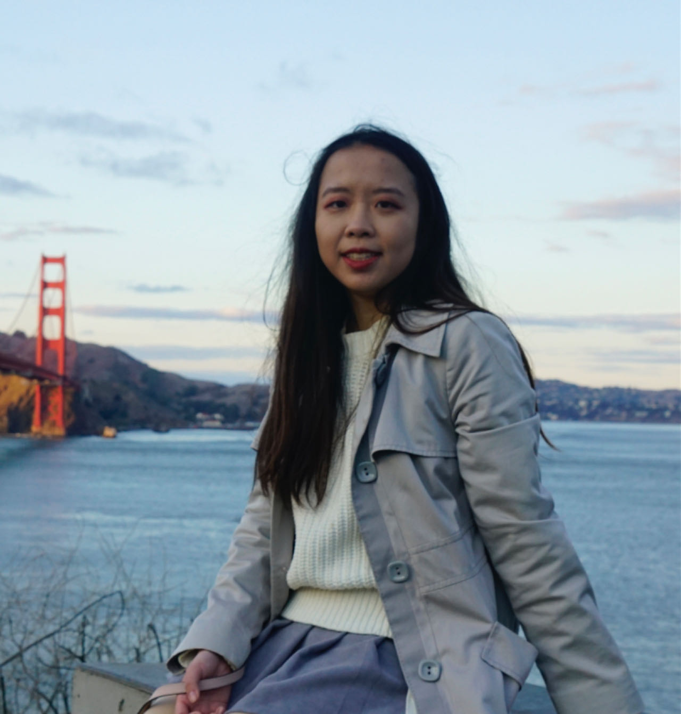

## About Me
I'm currently a PhD candidate at the [Statistical Artificial Intellgent & Learning Lab (TSAIL)](https://ml.cs.tsinghua.edu.cn/) of Tsinghua University, under the guidance of Professor  [Jun Zhu](https://ml.cs.tsinghua.edu.cn/~jun/index.shtml). From 2017 to 2021, I completed my bachelor's degree at the University of California, Berkeley, with triple majors in mathematics, computer science, and data science.

My research interests encompass statistical machine learning, the theoretical aspects of deep learning, and their practical applications. Specifically, I am currently focused on generative adversarial models.

Email: luotj21@mails.tsinghua.edu.cn and t.luo@berkeley.edu

## Research
- **Luo, T.**, Pearce T., Chen H., Chen J. and Zhu J. [*C-GAIL: Stabilizing Generative Adversarial Imitation Learning with Control Theory*](https://arxiv.org/abs/2402.16349). Advances in Neural Information Processing Systems (NeurIPS), 2024
- **Luo, T.**, Zhu Z., Chen J. and Zhu J. [*Stabilizing GANs’Training with Brownian Motion Controller*](https://proceedings.mlr.press/v202/luo23g/luo23g.pdf). Proceedings of the 40
th International Conference on Machine Learning (ICML), Honolulu, Hawaii, USA. PMLR 202, 2023
- **Luo, T.**, Wang, Q., Jia, Q. and Xu, Y. [*Asymptotic and finite-time synchronization of fractional-order multiplex networks with time delays by adaptive and impulsive control*](https://www.sciencedirect.com/science/article/abs/pii/S0925231221019445). Neurocomputing, 493, pp.445-461, 2022
- **Luo, T.** [*Stabilization of multi-group models with multiple dispersal and stochastic perturbation via feedback control based on discrete-time state observations*](https://www.sciencedirect.com/science/article/abs/pii/S0096300319300670). Applied Mathematics and Computation, 354, pp.396-410, 2019
- **Luo, T.**, Zhang, J., Wu, Y. and Wang, P. [*Stability Analysis of Discrete-Time Coupled Systems on Networks With Time-Varying Delay*](https://ieeexplore.ieee.org/document/8865586). In 2019 Chinese Control Conference (CCC) (pp. 1201-1206). IEEE, 2019

## Work Experience 
Quantitative Researcher Intern, [Lingjun Investment](https://www.lingjuninvest.com/?lang=en-us), Shanghai, China, Jul. 2023- Oct. 2023

Software Engineer Intern, [Cadence Design Systems](https://www.cadence.com/en_US/home.html), San Jose, CA, USA, Jun. 2019- Aug. 2019

Research Assistant, [Berkeley Institute for Data Science (BIDS)](https://bids.berkeley.edu/), Berkeley, CA, USA, Sep.2018- Dec.2018

## Services
Reviewer for ICML, ICLR, NeurIPS, and TPAMI

## Teaching Experience 
- TA for Deep Learning with Professor Jun Zhu and Professor Xiaolin Hu at Tsinghua University in Spring 2024
- TA for Linear Algebra with Professor Yilong Yang at Tsinghua University in Fall 2023
- TA for PhD English Writing with Professor Ying Zhang at Tsinghua University in Spring 2023
- TA for Machine Learning with Professor Jie Tang and Professor Jun Zhu at Tsinghua University in Fall 2022
- Reader for [Designing, Visualizing and Understanding Deep Neural Networks (CS182)](https://cs182sp21.github.io/) with Professor Sergey Levine at UC Berkeley in Spring 2020
  
  
